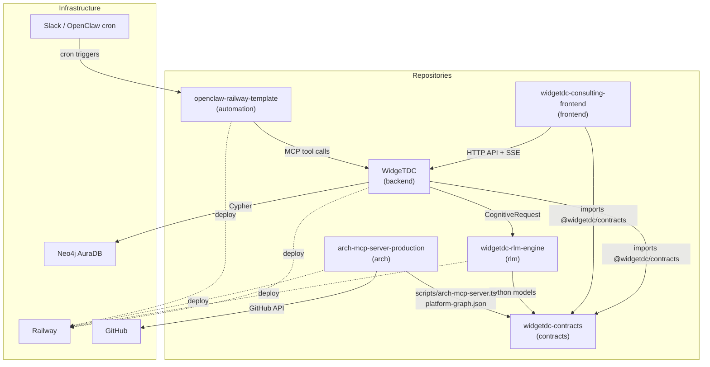

# WidgeTDC Ecosystem Architecture (2026-02)

Technical architecture map for the WidgeTDC Autonomous Consulting Intelligence Platform.

## Diagram

## Contract Boundaries

| Contract | Usage |
|----------|-------|
| `ApiResponse` | All HTTP responses (success/error envelope) |
| `CognitiveRequest` / `CognitiveResponse` | Backend ↔ RLM reasoning |
| `HealthPulse` | Health checks across services |

## Primary API Paths

| Path | Service | Purpose |
|------|---------|---------|
| `/api/mcp/route` | Backend | MCP tool routing (OpenClaw, agents) |
| `/api/contracts` | Backend | Runtime contract catalog |
| `/api/analysis` | arch-mcp-server | Architecture analysis |
| `/api/changelog` | arch-mcp-server | GitHub commits |
| `/api/branches` | arch-mcp-server | PRs & unmerged branches |

## Operational Notes

- **Backend + RLM**: Railway only — never run locally
- **Contracts**: Single source of truth; consumers pin `@widgetdc/contracts` v0.2.0
- **OpenClaw automation**: Cron-driven via Slack; policy in `cron-routing.profile.json`
