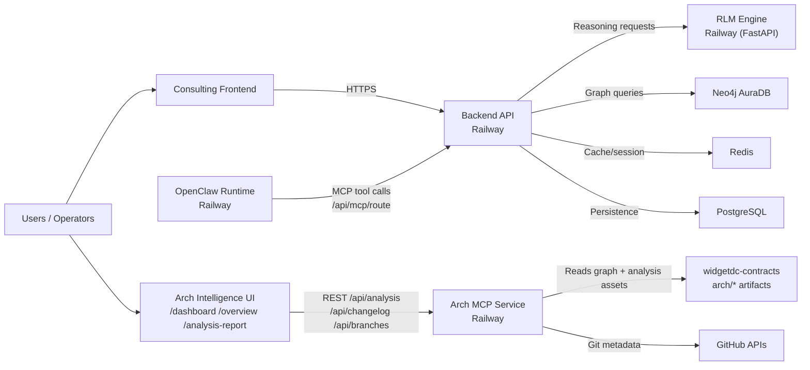

# WidgeTDC Updated Architecture Repo Map (2026-02-25)

This document provides an updated architecture drawing focused on repositories,
cross-service contracts, and runtime integrations.

## 1) Repository Landscape

## 2) Contract and Data Flow

## 3) Runtime Service Topology (Production-Oriented)

## 4) Notes for Current State

- Canonical cross-service types are maintained in `widgetdc-contracts`.
- Backend remains the main integration point for frontend, OpenClaw, and RLM workflows.
- Arch MCP service acts as architecture observability/control-plane visualization across repos.
- OpenClaw operates as an external automation layer and should keep output contracts explicit.
