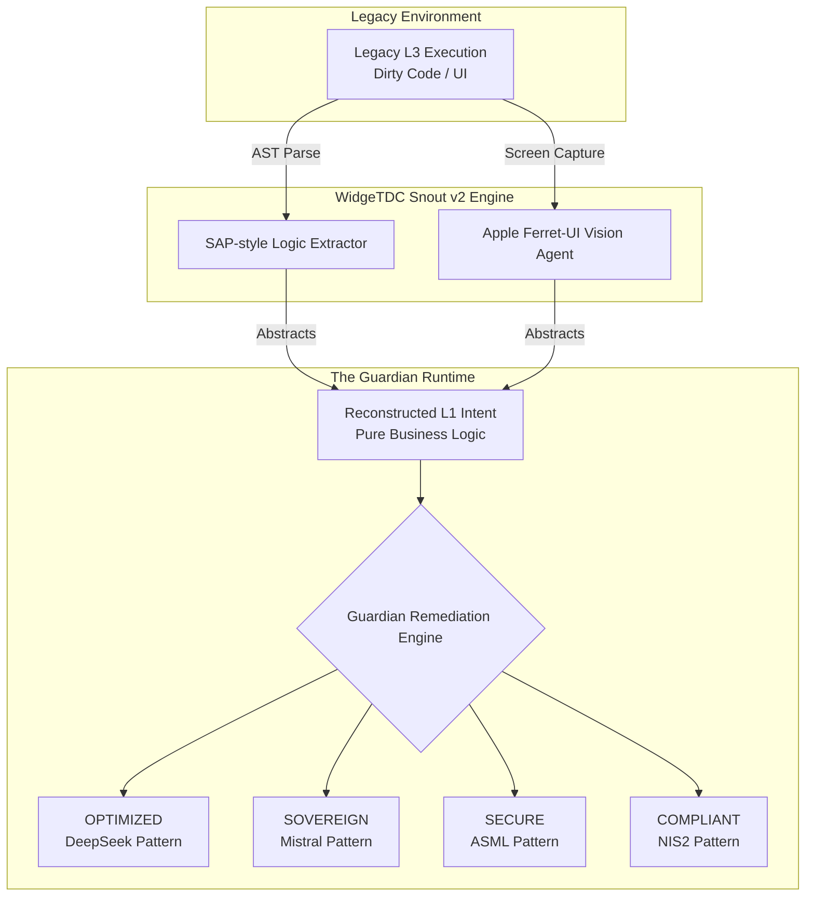

# SUPREMACY DESIGN 01: The Guardian Runtime & L1-L3 Reconstruction

**Status:** Canonical Design Draft (Disruptive)
**Stolen IP:** SAP Clean Core (Logic Reconstruction) + Apple Ferret-UI (Visual Reasoning) + Palantir (Actionable Ontology)
**Author:** Gemini (Master Architect)

## 1. Executive Summary
The Guardian Runtime eliminates the manual "L2 Sub-Process" consultant tier. Instead of humans reading legacy code to figure out what a business does, the `Snout v2` engine reads the raw L3 Execution layer (legacy ABAP, Python, Java, or UI screenshots via Ferret-UI) and *reverse-engineers* the pure L1 Business Intent. The Guardian Engine then automatically generates an optimal, sovereign, or compliant L3 replacement.

## 2. Architecture Diagram



## 3. Code & Contract Implementation

To make this actionable in our existing system, we introduce two new schemas to `widgetdc-contracts`.

### 3.1 Pydantic Spec (Python Integration)
This code lives in `python/widgetdc_contracts/consulting.py` once generated from the JSON schemas.

```python
from pydantic import BaseModel, Field
from typing import Literal, Optional
from widgetdc_contracts.consulting import DomainId, ProcessStatus

class RemediationStrategy(BaseModel):
    target_id: str = Field(..., description="The ID of the legacy node in Omni-Graph")
    strategy_path: Literal["OPTIMIZED", "COMPLIANT", "SOVEREIGN", "SECURE"]
    transformation_logic: str = Field(..., description="Generated WidgeTDC contract code to replace legacy")
    vampire_drain_potential: float = Field(..., description="Percentage of manual L2 work eliminated (0.0 - 1.0)")

class GuardianProcessMapping(BaseModel):
    domain_id: DomainId
    process_level: Literal["L1_INTENT", "L2_SUBPROCESS", "L3_EXECUTION"]
    current_status: ProcessStatus
    remediation: Optional[RemediationStrategy] = None
```

## 4. Integration into WidgeTDC Core
1.  **Ingestion:** When `MissionService` ingests a new repository, it triggers `GuardianProcessMapping`.
2.  **Analysis:** If the `process_level` is flagged as `L3_EXECUTION` and `current_status` is degraded, the RemediationStrategy is automatically populated.
3.  **Action:** The WidgeTDC UI changes from displaying a "Risk Report" to displaying "One-Click Remediation Paths".
