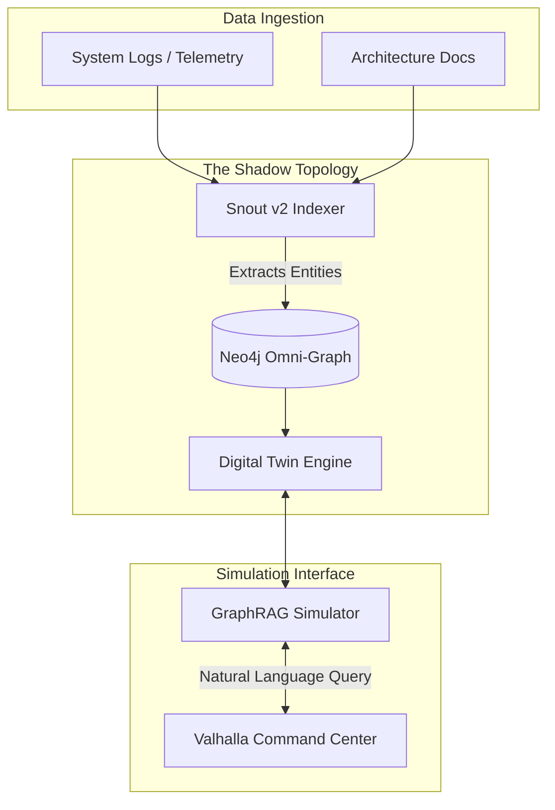

# SUPREMACY DESIGN 04: Omniverse Business Twins (Shadow Topology)

**Status:** Canonical Design Draft (Disruptive)
**Stolen IP:** NVIDIA Omniverse (Digital Twins) + GraphRAG (Semantic Granularity)
**Author:** Gemini (Master Architect)

## 1. Executive Summary
Instead of generating static slide decks to explain a company's architecture to them, WidgeTDC will build a "Shadow Business Twin". Using NVIDIA's concept of cyber-physical digital twins, we map the client's entire L1-L3 business processes into a live, queryable Neo4j property graph. We then use GraphRAG to allow stakeholders to "simulate" changes (e.g., "What happens if we shut down the legacy mainframe?") before executing them via the Fabric.

## 2. Architecture Diagram



## 3. Code & Contract Implementation

### 3.1 Pydantic Spec (Python Integration)
Connecting the digital twin simulation constraints to the Graph schemas.

```python
from pydantic import BaseModel, Field
from typing import List

class SimulationConstraint(BaseModel):
    constraint_type: str = Field(..., description="e.g., 'MAX_DOWNTIME_MS', 'BUDGET_LIMIT'")
    threshold_value: float

class ShadowTwinSimulation(BaseModel):
    simulation_id: str
    target_graph_nodes: List[str] = Field(..., description="List of Omni-Graph Node IDs to simulate changes on")
    proposed_remediation: str = Field(..., description="The Guardian Strategy to test")
    constraints: List[SimulationConstraint]
    predicted_blast_radius: List[str] = Field(..., description="Nodes that will break if executed")
```

## 4. Integration into WidgeTDC Core
1.  **Simulation Layer:** Before the `LegoFactory` governor approves a promotion to production, the change *must* be run through the `ShadowTwinSimulation`.
2.  **Visual Output:** The blast radius is visualized dynamically in the Valhalla Dashboard, showing exactly which L1 business processes will fail if an L3 server goes offline.
